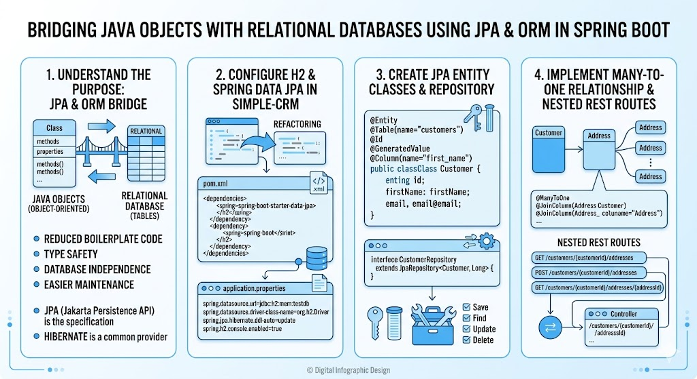

# [3.16] Object-Relational Mapping with JPA

## Lesson Overview

## Dependencies

- [Self Studies](./studies.md) / [Lesson](./lesson.md) / [Assignment](./assignment.md) / [Slide Deck](./slides.md)

## Lesson Objectives

By the end of this lesson, students will be able to:

* **Explain** the purpose of JPA and ORM in bridging Java objects with relational databases
* **Configure** H2 and Spring Data JPA and refactor `simple-crm` to use a real database
* **Create** JPA entity classes with primary keys, column mappings, and a `JpaRepository`
* **Implement** a many-to-one relationship and expose nested REST routes

## Lesson Plan

| Duration | What | How or Why |
|---|---|---|
| 10 min | Warm-up | Recap the Service-Repository pattern from Lesson 3.14 — students will be refactoring that same structure today |
| 10 min | Part 1 & 2: H2 + JPA + Hibernate | Conceptual intro — explain what ORM is, why it matters, and how JPA/Hibernate fit together |
| 25 min | Part 3: Refactor `simple-crm` — dependencies, H2 config, entity annotations | Code-along — add dependencies, configure `application.properties`, annotate `Customer` as a JPA entity with `@Id`, `@GeneratedValue`, `@Column` |
| 20 min | Part 3: Set up `JpaRepository` + update service layer | Code-along — replace old `CustomerRepository` class with `JpaRepository` interface; update all service methods to use repository |
| 15 min | Part 3: Update controller + service interface | Code-along — change `id` types from `String` to `Long`; verify all endpoints work via Postman and H2 console |
| 10 min | Part 4: DataLoader with `@PostConstruct` | Code-along — preload seed data; demonstrate `@PostConstruct` lifecycle |
| 10 min | Break | — |
| 10 min | Activity — Add `Interaction` entity + `InteractionRepository` | Students independently create the `Interaction` entity with JPA annotations and a `JpaRepository` |
| 25 min | Part 5: Many-to-One relationship + nested routes | Code-along — add `@ManyToOne` and `@JoinColumn` to `Interaction`; build `POST /customers/{id}/interactions` nested route |
| 15 min | Wrap-up + H2 console verification | Verify foreign key column in H2; recap ORM, entity annotations, JpaRepository, and nested routes |
| 10 min | Optional preview: Parts 6 & 7 | Brief walkthrough of bidirectional `@OneToMany` and `CascadeType.ALL` for students who want to explore further |
| **180 min** | **Total** | |