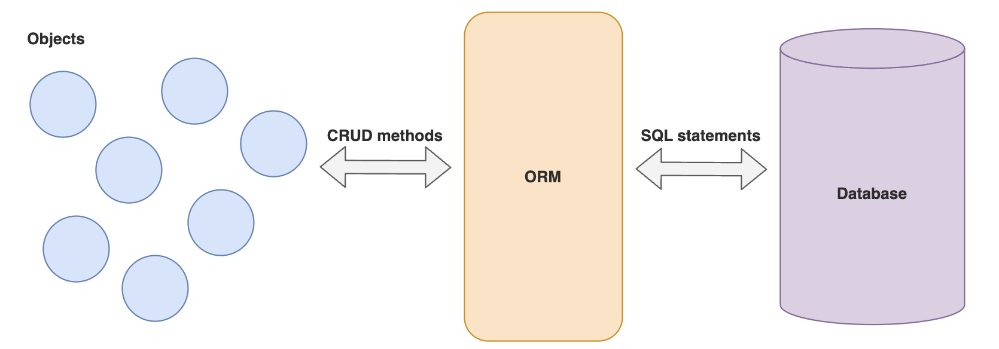

# Lesson: Object-Relational Mapping with JPA

## Lesson Overview
In this lesson, you will refactor the existing `simple-crm` application to use Java Persistence API (JPA) with Hibernate and an in-memory H2 database. You will learn how Object-Relational Mapping (ORM) bridges Java classes and relational tables, how to define entities, primary keys, and repositories, and how to model real-world relationships such as one-to-many and many-to-one within a Spring Boot project.

## Lesson Objectives
- Understand the purpose of JPA and ORM in bridging Java objects with relational databases.  
- Configure and use H2 and Spring Data JPA for schema generation and data persistence.  
- Create entity classes with annotations for primary keys, columns, and relationships.  
- Implement a unidirectional many-to-one relationship and expose nested REST routes.  
- (Optional) Extend to bidirectional one-to-many relationships with cascading and JSON-safe serialization.

# Introduction to JPA and H2

This is an updated lesson for the original 3.12. It builds on our previous `simple-crm` project to introduce JPA and H2.

You might want to make a copy of the `simple-crm` project before proceeding so that you can refer to it later.

## Part 1: H2


H2 is a relational database written in Java. It is very fast, open source and lightweight. This makes it useful for quick prototyping, testing and development.

H2 is a JPA-compliant database, which means that it can be used with JPA. We will be using H2 in this lesson to learn about JPA.

---

## Part 2: JPA and Hibernate

JPA now stands for **Jakarta Persistence API**, previously known as **Java Persistence API**. The name change was due to Oracle transferring Java EE to the Eclipse Foundation and since Oracle owns the trademark for Java, the name had to be changed. If you're interested you can read up further [here](https://www.baeldung.com/java-enterprise-evolution).

JPA is a specification for accessing, persisting, and managing data between Java objects and a relational database.

### Object Relational Mapping (ORM)

ORM is a programming technique for mapping objects to relational databases. It is a way to store and retrieve data from a database using object-oriented programming languages.

This is useful because it allows us to use the same object-oriented code to interact with different databases, instead of having to write code specific to each database.

The syntax of different databases can vary greatly, so using an ORM allows us to write code that is independent of the database we are using. e.g. the syntax for creating a table in MySQL is different from the syntax for creating a table in PostgreSQL.



## Hibernate


Note that JPA is only a specification i.e. it is not an implementation.

Hibernate is an implementation of the JPA specification. It is an ORM tool that provides a framework for mapping an object-oriented domain model to a relational database.

By default, Spring Boot uses Hibernate as its JPA implementation. Hence, we may sometimes use the terms JPA and Hibernate interchangeably.

---

## Part 3: Refactoring `simple-crm` to use JPA and H2

### Install JPA and H2

Let's add Spring Data JPA and H2 to our project.

```xml
<dependency>
  <groupId>org.springframework.boot</groupId>
  <artifactId>spring-boot-starter-data-jpa</artifactId>
</dependency>

<dependency>
  <groupId>com.h2database</groupId>
  <artifactId>h2</artifactId>
  <scope>runtime</scope>
</dependency>
```

The scope of the H2 dependency is set to `runtime` because we only need it for development and testing. It will not be needed in production.

### Configure and Test H2

We need to configure H2 to create a database in memory.

Let's add the settings into `application.properties`.

```properties
# Enables the H2 console, which is a UI for the H2 database.
spring.h2.console.enabled=true
# The URL path to the H2 console.
spring.h2.console.path=/h2
# The JDBC URL for the H2 database.
# You can change the name as needed -> simple-crm
spring.datasource.url=jdbc:h2:mem:simple-crm
```

Start the app with `mvn clean spring-boot:run` and try accessing the H2 console at `http://localhost:8080/h2`.


Test the connection.

### Create a JPA Entity

What is an entity? It is a Java class that is mapped to a database table. The objects of this class will be managed by JPA and persisted to the database for us.


In our `Customer` class, we will add the `@Entity` annotation to indicate that it is an entity. This tells JPA that this class is to be mapped to a database table.

We will also add the `@Table` annotation to specify the name of the database table that this entity will be mapped to.

```java
@Entity
@Table(name = "customer")
public class Customer {
  // ...
}
```

### Define a Primary Key and Name the Columns

What is a **primary key (PK)**? It is a column in a database table that uniquely identifies each row in that table. It is used to ensure that each row in a table is unique. For example, in a `customers` table, the PK could be the `id` column.

| id 🔑 | name    | email               |
| ----- | ------- | ------------------- |
| 1     | Alice   | alice@example.com   |
| 2     | Bob     | bob@example.com     |
| 3     | Charlie | charlie@example.com |

We can tell JPA which column is the primary key by adding the `@Id` annotation to the field.

For the PK, we will use a `Long` type and annotate it with `@Id` and `@GeneratedValue`. The `@GeneratedValue` annotation is used to specify the strategy for generating the PK values. We will use the `GenerationType.IDENTITY` strategy, which means that the PK values will be generated by the database.

These are the available strategies:

| Strategy                  | Description                                                                                                                              |
| ------------------------- | ---------------------------------------------------------------------------------------------------------------------------------------- |
| `GenerationType.AUTO`     | Indicates that the persistence provider should pick an appropriate strategy for the particular database. This is the default strategy.   |
| `GenerationType.IDENTITY` | Indicates that the persistence provider must assign primary keys for the entity using a database identity column.                        |
| `GenerationType.SEQUENCE` | Indicates that the persistence provider must assign primary keys for the entity using a database sequence.                               |
| `GenerationType.TABLE`    | Indicates that the persistence provider must assign primary keys for the entity using an underlying database table to ensure uniqueness. |

It is also possible to use a custom generator. You can read more about the generators [here](https://www.baeldung.com/hibernate-identifiers).

Next we will add the `@Column` annotation to the `id` field to specify the name of the column in the database table that this field will be mapped to.

```java
@Id
@GeneratedValue(strategy = GenerationType.IDENTITY)
@Column(name = "id")
private Long id;
```

And proceed to do the same for the other fields. For multiple words, the convention is to use snake case e.g. `first_name`.

```java
@Column(name = "first_name")
private String firstName;
@Column(name = "last_name")
private String lastName;
@Column(name = "email")
private String email;
@Column(name = "contact_no")
private String contactNo;
@Column(name = "job_title")
private String jobTitle;
@Column(name = "year_of_birth")
private int yearOfBirth;
```

Now, run the app and check the H2 console.

The table should have been created for us but it has no data. Let's add some data.

How we would do it in SQL would be something like this:

```sql
INSERT INTO customer (first_name, last_name, email, contact_no, job_title, year_of_birth)
VALUES ('John', 'Doe', 'john.doe@example.com', '12345678', 'Software Engineer', 1985);
```

But fortunately, with JPA, we do not have to write SQL statements. The ORM is the middleman between our Java code and the database. We can use Java to interact with the database.

### Set Up the Repository

Now, we need to create a repository to interact with the database. As you might recall, the repository is the layer that handles the data access logic.

This time though, we do not need to define a repository class. Instead, we will define a `CustomerRepository` interface that extends the `JpaRepository` interface. You can rename the current `CustomerRepository.java` to `CustomerRepository.java.old` for reference. Then create a new `CustomerRepository.java`.

```java
public interface CustomerRepository extends JpaRepository<Customer, Long> {
}
```

In the type parameters, we specify the entity type and the type of the primary key, which in this case, are `Customer` and `Long` respectively.

The `JpaRepository` interface provides us with many methods for interacting with the database. The good thing is, we do not need to write any code to implement these methods. Spring JPA will automatically generate the implementation for us. This will then become a bean in our Spring container, which we can inject into our service layer.

Note that we also did not have to annotate the interface with `@Repository` because this will be handled by Spring JPA.

## Update the Service Layer

With the repository in place, our service layer can now use the repository since we have already used dependency injection to inject the repository into the service.

```java
@Service
public class CustomerServiceImpl implements CustomerService {
  private CustomerRepository customerRepository;

  @Autowired
  public CustomerServiceImpl(CustomerRepository customerRepository) {
    this.customerRepository = customerRepository;
  }

  // ...
}
```

The methods in the service layer can now be updated to use the repository.

```java
@Override
public Customer createCustomer(Customer customer) {
  Customer newCustomer = customerRepository.save(customer);
  return newCustomer;
}

@Override
public Customer getCustomer(Long id) {
  Customer foundCustomer = customerRepository.findById(id).get();
  return foundCustomer;
}

@Override
public ArrayList<Customer> getAllCustomers() {
  List<Customer> allCustomers = customerRepository.findAll();
  return (ArrayList<Customer>) allCustomers;
}


@Override
public Customer updateCustomer(Long id, Customer customer) {
  // retrieve the customer from the database
  Customer customerToUpdate = customerRepository.findById(id).get();
  // update the customer retrieved from the database
  customerToUpdate.setFirstName(customer.getFirstName());
  customerToUpdate.setLastName(customer.getLastName());
  customerToUpdate.setEmail(customer.getEmail());
  customerToUpdate.setContactNo(customer.getContactNo());
  customerToUpdate.setJobTitle(customer.getJobTitle());
  customerToUpdate.setYearOfBirth(customer.getYearOfBirth());
  // save the updated customer back to the database
  return customerRepository.save(customerToUpdate);
}

@Override
public void deleteCustomer(Long id) {
  customerRepository.deleteById(id);
}
```

Also, the helper method `getCustomerIndex` can also be removed since we are no longer using it.

### Updating CustomerController and CustomerService interface

Finally, we have to update the type of the id in our `CustomerController` and the `CustomerService` interface, since we are now using a `Long` type instead of a `String` type for the `id`.

Change `String` to `Long` in `CustomerController`:

```java
@GetMapping("{id}")
public ResponseEntity<Customer> getCustomer(@PathVariable Long id)

@PutMapping("{id}")
public ResponseEntity<Customer> updateCustomer(@PathVariable Long id, @RequestBody Customer customer)

@DeleteMapping("{id}")
public ResponseEntity<HttpStatus> deleteCustomer(@PathVariable Long id)
```

Change `String` to `Long` in the `CustomerService` interface:

```java
public interface CustomerService {
  Customer createCustomer(Customer customer);

  Customer getCustomer(Long id);

  ArrayList<Customer> getAllCustomers();

  Customer updateCustomer(Long id, Customer customer);

  void deleteCustomer(Long id);

}
```

For `CustomerServiceWithLoggingImpl.java`, in your free time, you can update it to use `Long` instead of `String` for the `id`, as well as the corresponding repository methods. For now, we can rename the file to `CustomerServiceWithLoggingImpl.java.old` so that we can test our code.

Post a few new customers and check the H2 console as well as the `GET endpoint` to see that the data is persisted and can be retrieved correctly.

---

## Part 4: Preloading Data with a `DataLoader` class

There are a few ways to preload data into the database.

If we have sql scripts, Hibernate can execute them for us. You can read more about this approach [here](https://www.masterspringboot.com/data-access/jpa-applications/preloading-data-in-spring-boot-with-import-sql-and-data-sql/).

Another way is to create a custom `DataLoader` class and annotate it with `@Component`. We can then load the data in method annotated with `@PostConstruct`. This method will be called after the bean has been created by Spring.

```java
@Component
public class DataLoader {
  private CustomerRepository customerRepository;

  @Autowired
  public DataLoader(CustomerRepository customerRepository) {
    this.customerRepository = customerRepository;
  }

  @PostConstruct
  public void loadData() {
    // clear the database first
    customerRepository.deleteAll();

    // load data here
    customerRepository.save(new Customer("Tony", "Stark"));
    customerRepository.save(new Customer("Bruce", "Banner"));
    customerRepository.save(new Customer("Peter", "Parker"));
    customerRepository.save(new Customer("Stephen", "Strange"));

  }
}
```

The advantage of this approach is that it is independent of the database type since we are using JPA. This means that we can switch to a different database without having to change the code. In addition, if we want to turn this off, we can simply comment out the `@Component` annotation.

---

## 👨‍💻 Activity

Add an `Interaction` resource to our app. This will be used to store the interactions
between a customer and a salesperson.

The `Interaction` resource should have the following fields:

```java
private Long id;
private String remarks;
private LocalDate interactionDate;
```

You should be able to post an interaction JSON like this:

```json
{
  "remarks": "Presented products to customer.",
  "interactionDate": "2023-08-01"
}
```

---

## Part 5: Many To One Relationship (Unidirectional)

Most of the time, the data in our database will be related to each other.

For example:

- MANY students work on ONE project
- MANY products are sold by ONE store
- MANY soccer players play for ONE team
- MANY interactions are made with ONE customer

In our application, MANY interactions can be associated with ONE customer. This is known as a **many-to-one** relationship.

In other words, we need to know which interactions are made with which customer. In SQL, this is done by adding a **foreign key** to the `interaction` table. A foreign key is a column that references the primary key of another table.

For example, this is our `Customer` table:

| id 🔑 | name    | email               |
| ----- | ------- | ------------------- |
| 1     | Alice   | alice@example.com   |
| 2     | Bob     | bob@example.com     |
| 3     | Charlie | charlie@example.com |

And this is our `Interaction` table:

| id 🔑 | remarks                                | interaction_date | customer_id 🗝️ |
| ----- | -------------------------------------- | ---------------- | -------------- |
| 1     | "Presented products to customer."      | 2021-01-01       | 1              |
| 2     | "Customer decided to buy the product." | 2021-01-02       | 1              |
| 3     | "Customer has a low budget currently." | 2021-01-03       | 2              |

The `customer_id` column in the `Interaction` table is a foreign key that references the `id` column in the `Customer` table.

With Spring JPA, all we have to do is to add the `@ManyToOne` annotation to the `customer` field in the `Interaction` class and this will be done for us.

With the `@ManyToOne` annotation, we are saying that MANY rows in the `Interaction` table can be associated with ONE row in the `Customer` table.

```java
@ManyToOne(optional = false)
@JoinColumn(name = "customer_id", referencedColumnName = "id")
private Customer customer;
```

By setting `optional = false`, we are telling JPA that the `customer` field is required and cannot be null. In other words, an interaction can only exist if it is associated with a customer.

The `@JoinColumn` annotation is used to specify the name of the foreign key column and the name of the column in the referenced table. In this case, the foreign key column is `customer_id` and it references the `id` column in the `Customer` table.

Run the app and check the H2 console. The `interactions` table should have been updated with the `customer_id` column.

### Nested Routes

A nested route is a route that is nested within another route. For example, `/customers/1/interactions` is a nested route because it is nested within the `/customers` route.

We use nested routes when we want to get a resource that is associated with another resource. For example, we want to get all the interactions for a particular customer.

A route like `/customers/1/interactions` refers to the interactions associated with the customer with id 1. Each HTTP method (`GET`, `POST`, `PUT`, `DELETE`) can be used to perform different actions on the interactions associated with the customer:

- `GET` - get all interactions associated with the customer
- `POST` - add an interaction to the customer
- `PUT` - update an interaction associated with the customer
- `DELETE` - delete an interaction associated with the customer

Let's update our controller with a nested route to add an interaction to a customer.

```java
// Nested route - add interaction to customer
@PostMapping("/{id}/interactions")
public ResponseEntity<Interaction> addInteractionToCustomer(@PathVariable long id, @RequestBody Interaction interaction) {
  Interaction newInteraction = customerService.addInteractionToCustomer(id, interaction);
  return new ResponseEntity<>(newInteraction, HttpStatus.OK);
}
```

This means we need a new service method to add an interaction to a customer. Since we are using an interface, we can add the method to the interface and implement it in the service implementation class.

```java
public interface CustomerService {
  // other method signatures
  Interaction addInteractionToCustomer(long id, Interaction interaction);
}
```

Now in our `CustomerServiceImpl`, we also need to use the `InteractionRepository` to save the interaction to the database. We also need to retrieve the customer from the database and add it to the interaction before saving it. It should inject the `InteractionRepository` and `CustomerRepository` into the service implementation class.

```java
private CustomerRepository customerRepository;
private InteractionRepository interactionRepository;

@Autowired
public CustomerServiceImpl(CustomerRepository customerRepository, InteractionRepository interactionRepository) {
  this.customerRepository = customerRepository;
  this.interactionRepository = interactionRepository;
}
```

Then we can add the method to the service implementation class.

```java
@Override
public Interaction addInteractionToCustomer(long id, Interaction interaction) {
  // retrieve the customer from the database
  Customer selectedCustomer = customerRepository.findById(id).get();
  // add the customer to the interaction
  interaction.setCustomer(selectedCustomer);
  // save the interaction to the database
  return interactionRepository.save(interaction);
}
```

Test out adding interactions to a customers to the endpoint `localhost:8080/customers/1/interactions`

---

## Part 6 (Optional): One To Many Relationship (Bidirectional)

Currently, when we get an interaction, we can see the customer associated with it. But when we get a customer, we cannot see the interactions associated with it. This is because it is a **unidirectional** relationship.

Sometimes we might want to see the interactions associated with a customer as well. This is known as a **bidirectional** relationship.

To see the interactions associated with a customer, we need to create a **one-to-many** relationship, i.e. ONE customer can have MANY interactions.

In our `Customer` class, we will add the `@OneToMany` annotation to the `interactions` field to indicate that it is a one-to-many relationship. The `mappedBy` attribute is used to specify the field in the `Interaction` class that maps this relationship. This tells Spring JPA that the owner of this relationship is the `Interaction` class, because it is the one that has the foreign key.

```java
@OneToMany(mappedBy = "customer")
private List<Interaction> interactions;
```

If you try to add an interaction or get a customer with interactions now, the application will crash. This is because there is an infinite recursion problem. The `Customer` class has a list of `Interaction` objects, and each `Interaction` object has a `Customer` object. This will cause an infinite loop.

To solve this, we can use the `@JsonBackReference` annotation on the `customer` field in the `Interaction` class.

```java
@JsonBackReference
@ManyToOne(optional = false)
@JoinColumn(name = "customer_id", referencedColumnName = "id")
private Customer customer;
```

Test it again and see.

---

## Part 7 (Optional): Cascade

When we delete a customer, we also want to delete all the interactions associated with that customer. This is known as **cascading**.

Currently, if you try to delete a customer, you will get an error because there are interactions associated with that customer.

To solve this, we can use the `CascadeType.ALL` attribute on the `interactions` field in the `Customer` class. This tells JPA to cascade all operations (e.g. save, update, delete) to the associated interactions.

```java
@OneToMany(mappedBy = "customer", cascade = CascadeType.ALL)
private List<Interaction> interactions;
```

---

END