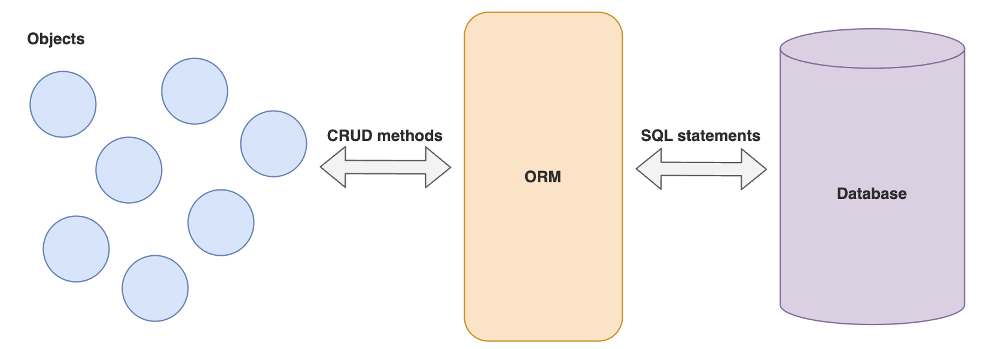
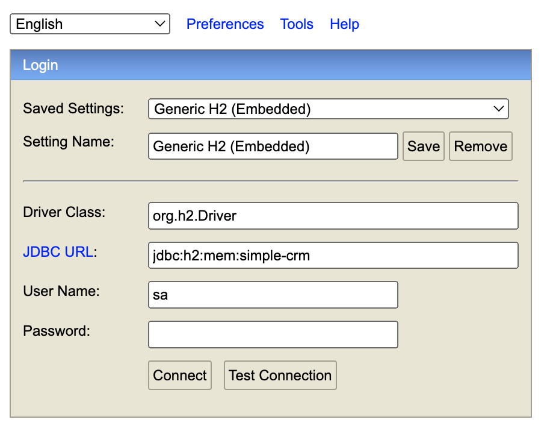
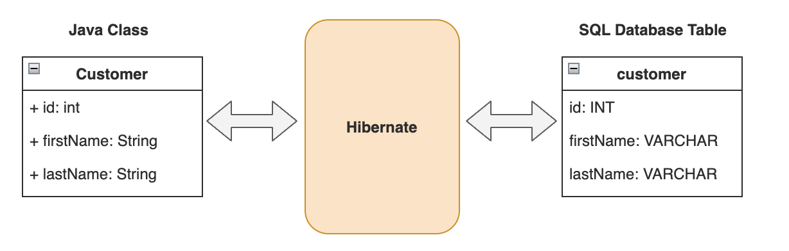

# Lesson: Object-Relational Mapping with JPA

## Lesson Overview
In this lesson, you will refactor the existing `simple-crm` application to use Java Persistence API (JPA) with Hibernate and an in-memory H2 database. You will learn how Object-Relational Mapping (ORM) bridges Java classes and relational tables, how to define entities, primary keys, and repositories, and how to model real-world relationships such as one-to-many and many-to-one within a Spring Boot project.

## Lesson Objectives
By the end of this lesson, students will be able to:

1. **Explain** the purpose of JPA and ORM in bridging Java objects with relational databases
2. **Configure** H2 and Spring Data JPA and refactor `simple-crm` to use a real database
3. **Create** JPA entity classes with primary keys, column mappings, and a `JpaRepository`
4. **Implement** a many-to-one relationship and expose nested REST routes

---

## Part 1: H2


H2 is a relational database written in Java. It is very fast, open source and lightweight. This makes it useful for quick prototyping, testing and development.

H2 is a JPA-compliant database, which means that it can be used with JPA. We will be using H2 in this lesson to learn about JPA.

---

## Part 2: JPA and Hibernate

JPA now stands for **Jakarta Persistence API**, previously known as **Java Persistence API**. The name change was due to Oracle transferring Java EE to the Eclipse Foundation and since Oracle owns the trademark for Java, the name had to be changed. If you're interested you can read up further [here](https://www.baeldung.com/java-enterprise-evolution).

JPA is a specification for accessing, persisting, and managing data between Java objects and a relational database.

### Object Relational Mapping (ORM)

ORM is a programming technique for mapping objects to relational databases. It is a way to store and retrieve data from a database using object-oriented programming languages.

This is useful because it allows us to use the same object-oriented code to interact with different databases, instead of having to write code specific to each database.

The syntax of different databases can vary greatly, so using an ORM allows us to write code that is independent of the database we are using. e.g. the syntax for creating a table in MySQL is different from the syntax for creating a table in PostgreSQL.



## Hibernate


Note that JPA is only a specification i.e. it is not an implementation.

Hibernate is an implementation of the JPA specification. It is an ORM tool that provides a framework for mapping an object-oriented domain model to a relational database.

By default, Spring Boot uses Hibernate as its JPA implementation. Hence, we may sometimes use the terms JPA and Hibernate interchangeably.

---

## Part 3: Refactoring `simple-crm` to use JPA and H2

You might want to make a copy of the `simple-crm` project before proceeding so that you can refer to it later.

### Install JPA and H2

Let's add Spring Data JPA and H2 to our project.

```xml
<dependency>
  <groupId>org.springframework.boot</groupId>
  <artifactId>spring-boot-starter-data-jpa</artifactId>
</dependency>

<dependency>
  <groupId>com.h2database</groupId>
  <artifactId>h2</artifactId>
  <scope>runtime</scope>
</dependency>
```

The scope of the H2 dependency is set to `runtime` because we only need it for development and testing. It will not be needed in production.

### Configure and Test H2

We need to configure H2 to create a database in memory.

Let's add the settings into `application.properties`.

```properties
# Enables the H2 console, which is a UI for the H2 database.
spring.h2.console.enabled=true
# The URL path to the H2 console.
spring.h2.console.path=/h2
# The JDBC URL for the H2 database.
spring.datasource.url=jdbc:h2:mem:simple-crm
```

Start the app with `mvn clean spring-boot:run` and try accessing the H2 console at `http://localhost:8080/h2`.



Test the connection.

### Create a JPA Entity

What is an entity? It is a Java class that is mapped to a database table. The objects of this class will be managed by JPA and persisted to the database for us.



In our `Customer` class, we will add the `@Entity` annotation to indicate that it is an entity. This tells JPA that this class is to be mapped to a database table.

We will also add the `@Table` annotation to specify the name of the database table that this entity will be mapped to.

```java
@Entity
@Table(name = "customer")
public class Customer {
  // ...
}
```

### Define a Primary Key and Name the Columns

What is a **primary key (PK)**? It is a column in a database table that uniquely identifies each row in that table. It is used to ensure that each row in a table is unique.

| id 🔑 | name    | email               |
| ----- | ------- | ------------------- |
| 1     | Alice   | alice@example.com   |
| 2     | Bob     | bob@example.com     |
| 3     | Charlie | charlie@example.com |

We can tell JPA which column is the primary key by adding the `@Id` annotation to the field.

For the PK, we will use a `Long` type and annotate it with `@Id` and `@GeneratedValue`. The `@GeneratedValue` annotation is used to specify the strategy for generating the PK values. We will use the `GenerationType.IDENTITY` strategy, which means that the PK values will be generated by the database.

These are the available strategies:

| Strategy | Description |
|---|---|
| `GenerationType.AUTO` | The persistence provider picks an appropriate strategy for the particular database. This is the default. |
| `GenerationType.IDENTITY` | Primary keys are assigned using a database identity column. |
| `GenerationType.SEQUENCE` | Primary keys are assigned using a database sequence. |
| `GenerationType.TABLE` | Primary keys are assigned using an underlying database table to ensure uniqueness. |

You can read more about the generators [here](https://www.baeldung.com/hibernate-identifiers).

Next we will add the `@Column` annotation to the `id` field to specify the name of the column in the database table.

```java
@Id
@GeneratedValue(strategy = GenerationType.IDENTITY)
@Column(name = "id")
private Long id;
```

Proceed to do the same for the other fields. For multiple words, the convention is to use snake case e.g. `first_name`.

```java
@Column(name = "first_name")
private String firstName;
@Column(name = "last_name")
private String lastName;
@Column(name = "email")
private String email;
@Column(name = "contact_no")
private String contactNo;
@Column(name = "job_title")
private String jobTitle;
@Column(name = "year_of_birth")
private int yearOfBirth;
```

Now, run the app and check the H2 console. The table should have been created for us but it has no data. Let's add some.

How we would do it in SQL would be something like this:

```sql
INSERT INTO customer (first_name, last_name, email, contact_no, job_title, year_of_birth)
VALUES ('John', 'Doe', 'john.doe@example.com', '12345678', 'Software Engineer', 1985);
```

But fortunately, with JPA, we do not have to write SQL statements. The ORM is the middleman between our Java code and the database.

### Set Up the Repository

Now, we need to create a repository to interact with the database. This time, instead of a class, we define a `CustomerRepository` interface that extends `JpaRepository`. You can rename the current `CustomerRepository.java` to `CustomerRepository.java.old` for reference. Then create a new `CustomerRepository.java`.

```java
public interface CustomerRepository extends JpaRepository<Customer, Long> {
}
```

In the type parameters, we specify the entity type and the type of the primary key — `Customer` and `Long` respectively.

The `JpaRepository` interface provides many ready-made methods for interacting with the database. Spring JPA automatically generates the implementation for us and registers it as a bean in the Spring container, which we can inject into our service layer.

Note that we do not need to annotate this interface with `@Repository` — Spring JPA handles that automatically.

### Update the Service Layer

With the repository in place, update the service layer to use it. The `CustomerServiceImpl` should inject the repository via constructor injection.

```java
@Service
public class CustomerServiceImpl implements CustomerService {
  private CustomerRepository customerRepository;

  @Autowired
  public CustomerServiceImpl(CustomerRepository customerRepository) {
    this.customerRepository = customerRepository;
  }
}
```

Now update the service methods to use the repository.

```java
@Override
public Customer createCustomer(Customer customer) {
  return customerRepository.save(customer);
}

@Override
public Customer getCustomer(Long id) {
  return customerRepository.findById(id).get();
}

@Override
public ArrayList<Customer> getAllCustomers() {
  return new ArrayList<>(customerRepository.findAll());
}

@Override
public Customer updateCustomer(Long id, Customer customer) {
  // Retrieve the customer from the database
  Customer customerToUpdate = customerRepository.findById(id).get();
  // Update the fields
  customerToUpdate.setFirstName(customer.getFirstName());
  customerToUpdate.setLastName(customer.getLastName());
  customerToUpdate.setEmail(customer.getEmail());
  customerToUpdate.setContactNo(customer.getContactNo());
  customerToUpdate.setJobTitle(customer.getJobTitle());
  customerToUpdate.setYearOfBirth(customer.getYearOfBirth());
  // Save and return the updated customer
  return customerRepository.save(customerToUpdate);
}

@Override
public void deleteCustomer(Long id) {
  customerRepository.deleteById(id);
}
```

The helper method `getCustomerIndex` can also be removed since we are no longer using it.

### Update CustomerController and CustomerService Interface

We also need to update the `id` type from `String` to `Long` in `CustomerController` and the `CustomerService` interface.

Update `CustomerController`:

```java
@GetMapping("{id}")
public ResponseEntity<Customer> getCustomer(@PathVariable Long id)

@PutMapping("{id}")
public ResponseEntity<Customer> updateCustomer(@PathVariable Long id, @RequestBody Customer customer)

@DeleteMapping("{id}")
public ResponseEntity<HttpStatus> deleteCustomer(@PathVariable Long id)
```

Update the `CustomerService` interface:

```java
public interface CustomerService {
  Customer createCustomer(Customer customer);
  Customer getCustomer(Long id);
  ArrayList<Customer> getAllCustomers();
  Customer updateCustomer(Long id, Customer customer);
  void deleteCustomer(Long id);
}
```

For `CustomerServiceWithLoggingImpl.java`, rename it to `CustomerServiceWithLoggingImpl.java.old` for now so that it does not cause compilation errors while we test.

Post a few new customers and check the H2 console as well as the `GET` endpoint to verify that data is persisted and retrieved correctly.

---

## Part 4: Preloading Data with a `DataLoader` class

There are a few ways to preload data into the database. If we have SQL scripts, Hibernate can execute them for us. You can read more about this approach [here](https://www.masterspringboot.com/data-access/jpa-applications/preloading-data-in-spring-boot-with-import-sql-and-data-sql/).

Another way is to create a custom `DataLoader` class annotated with `@Component`. We load the data in a method annotated with `@PostConstruct`, which is called automatically after the bean has been created by Spring.

```java
@Component
public class DataLoader {
  private CustomerRepository customerRepository;

  @Autowired
  public DataLoader(CustomerRepository customerRepository) {
    this.customerRepository = customerRepository;
  }

  @PostConstruct
  public void loadData() {
    // Clear the database first
    customerRepository.deleteAll();

    // Load seed data
    customerRepository.save(new Customer("Tony", "Stark"));
    customerRepository.save(new Customer("Bruce", "Banner"));
    customerRepository.save(new Customer("Peter", "Parker"));
    customerRepository.save(new Customer("Stephen", "Strange"));
  }
}
```

The advantage of this approach is that it is database-independent since we are using JPA. If we want to turn it off, we can simply comment out the `@Component` annotation.

---

## 👨‍💻 Activity **(10 minutes)**

Add an `Interaction` resource to the app. This will be used to store the interactions between a customer and a salesperson.

The `Interaction` class should have the following fields:

```java
private Long id;
private String remarks;
private LocalDate interactionDate;
```

Annotate it as a JPA entity with appropriate `@Id`, `@GeneratedValue`, and `@Column` annotations. Create an `InteractionRepository` interface that extends `JpaRepository`.

You should be able to POST an interaction like this:

```json
{
  "remarks": "Presented products to customer.",
  "interactionDate": "2023-08-01"
}
```

---

## Part 5: Many To One Relationship (Unidirectional)

Most of the time, data in our database will be related to each other. For example:

- MANY students work on ONE project
- MANY products are sold by ONE store
- MANY interactions are made with ONE customer

In our application, MANY interactions can be associated with ONE customer. This is known as a **many-to-one** relationship.

In SQL, this is done by adding a **foreign key** to the `interaction` table. A foreign key is a column that references the primary key of another table.

For example, this is our `Customer` table:

| id 🔑 | name    | email               |
| ----- | ------- | ------------------- |
| 1     | Alice   | alice@example.com   |
| 2     | Bob     | bob@example.com     |
| 3     | Charlie | charlie@example.com |

And this is our `Interaction` table:

| id 🔑 | remarks | interaction_date | customer_id 🗝️ |
|---|---|---|---|
| 1 | "Presented products to customer." | 2021-01-01 | 1 |
| 2 | "Customer decided to buy the product." | 2021-01-02 | 1 |
| 3 | "Customer has a low budget currently." | 2021-01-03 | 2 |

The `customer_id` column in the `Interaction` table is a foreign key that references the `id` column in the `Customer` table.

With Spring JPA, all we have to do is add the `@ManyToOne` annotation to the `customer` field in the `Interaction` class.

```java
@ManyToOne(optional = false)
@JoinColumn(name = "customer_id", referencedColumnName = "id")
private Customer customer;
```

By setting `optional = false`, we are telling JPA that the `customer` field is required and cannot be null — an interaction can only exist if it is associated with a customer.

The `@JoinColumn` annotation specifies the name of the foreign key column (`customer_id`) and the column it references (`id` in the `Customer` table).

Run the app and check the H2 console. The `interaction` table should now have a `customer_id` column.

### Nested Routes

A nested route is a route that is nested within another route. For example, `/customers/1/interactions` is nested within `/customers`. We use nested routes when we want to access a resource that belongs to another resource.

For the `/customers/{id}/interactions` route:

- `POST` — add an interaction to the customer
- `GET` — get all interactions for the customer

Let's add a nested POST route to our controller:

```java
@PostMapping("/{id}/interactions")
public ResponseEntity<Interaction> addInteractionToCustomer(@PathVariable Long id, @RequestBody Interaction interaction) {
  Interaction newInteraction = customerService.addInteractionToCustomer(id, interaction);
  return new ResponseEntity<>(newInteraction, HttpStatus.OK);
}
```

Add the method signature to the `CustomerService` interface:

```java
public interface CustomerService {
  // existing method signatures...
  Interaction addInteractionToCustomer(Long id, Interaction interaction);
}
```

In `CustomerServiceImpl`, inject both repositories and implement the method:

```java
private CustomerRepository customerRepository;
private InteractionRepository interactionRepository;

@Autowired
public CustomerServiceImpl(CustomerRepository customerRepository, InteractionRepository interactionRepository) {
  this.customerRepository = customerRepository;
  this.interactionRepository = interactionRepository;
}

@Override
public Interaction addInteractionToCustomer(Long id, Interaction interaction) {
  // Retrieve the customer from the database
  Customer selectedCustomer = customerRepository.findById(id).get();
  // Associate the customer with the interaction
  interaction.setCustomer(selectedCustomer);
  // Save and return the interaction
  return interactionRepository.save(interaction);
}
```

Test adding interactions to a customer at `localhost:8080/customers/1/interactions`.

---

## Part 6 (Optional): One To Many Relationship (Bidirectional)

Currently, when we retrieve an interaction, we can see the customer associated with it. But when we retrieve a customer, we cannot see their interactions. This is a **unidirectional** relationship.

To make it **bidirectional** — so that retrieving a customer also returns their interactions — add the `@OneToMany` annotation to the `Customer` class.

```java
@OneToMany(mappedBy = "customer")
private List<Interaction> interactions;
```

The `mappedBy` attribute tells Spring JPA that the `Interaction` class owns the relationship (because it holds the foreign key).

If you try to retrieve a customer now, the application will crash due to **infinite recursion** — `Customer` has a list of `Interaction` objects, each of which has a `Customer`, which has a list of `Interaction` objects, and so on.

To fix this, add the `@JsonBackReference` annotation to the `customer` field in the `Interaction` class:

```java
@JsonBackReference
@ManyToOne(optional = false)
@JoinColumn(name = "customer_id", referencedColumnName = "id")
private Customer customer;
```

Test again to verify it works correctly.

---

## Part 7 (Optional): Cascade

Currently, if you try to delete a customer who has interactions, you will get an error because the interactions reference that customer.

To automatically delete all interactions when a customer is deleted, add `cascade = CascadeType.ALL` to the `@OneToMany` annotation in the `Customer` class:

```java
@OneToMany(mappedBy = "customer", cascade = CascadeType.ALL)
private List<Interaction> interactions;
```

This tells JPA to cascade all operations (save, update, delete) from the `Customer` to its associated `Interaction` records.

---

END