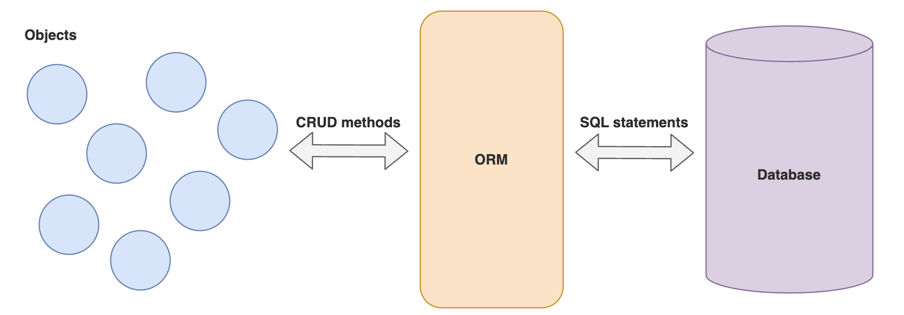
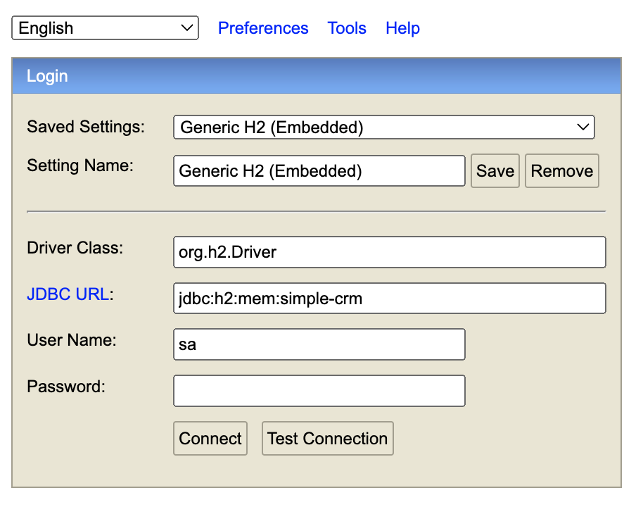
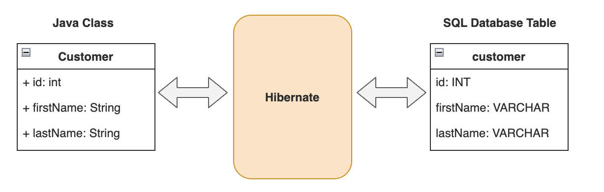

# Lesson: Object-Relational Mapping with JPA

## Lesson Overview
In this lesson, you will refactor the existing `simple-crm` application to use Java Persistence API (JPA) with Hibernate and an in-memory H2 database. You will learn how Object-Relational Mapping (ORM) bridges Java classes and relational tables, how to define entities, primary keys, and repositories, and how to model a real-world many-to-one relationship within a Spring Boot project.

## Lesson Objectives
By the end of this lesson, students will be able to:

1. **Explain** the purpose of JPA and ORM in bridging Java objects with relational databases
2. **Configure** H2 and Spring Data JPA and refactor `simple-crm` to use a real database
3. **Create** JPA entity classes with primary keys, column mappings, and a `JpaRepository`
4. **Implement** a many-to-one relationship and expose nested REST routes

---

## Part 1: H2


H2 is a relational database written in Java. It is very fast, open source and lightweight. This makes it useful for quick prototyping, testing and development.

H2 is a JPA-compliant database, which means that it can be used with JPA. We will be using H2 in this lesson to learn about JPA.

---

## Part 2: JPA and Hibernate

JPA now stands for **Jakarta Persistence API**, previously known as **Java Persistence API**. The name change was due to Oracle transferring Java EE to the Eclipse Foundation and since Oracle owns the trademark for Java, the name had to be changed. If you're interested you can read up further [here](https://www.baeldung.com/java-enterprise-evolution).

JPA is a specification for accessing, persisting, and managing data between Java objects and a relational database.

### Object Relational Mapping (ORM)

ORM is a programming technique for mapping objects to relational databases. It is a way to store and retrieve data from a database using object-oriented programming languages.

This is useful because it allows us to use the same object-oriented code to interact with different databases, instead of having to write code specific to each database.

The syntax of different databases can vary greatly, so using an ORM allows us to write code that is independent of the database we are using. e.g. the syntax for creating a table in MySQL is different from the syntax for creating a table in PostgreSQL.



## Hibernate


Note that JPA is only a specification i.e. it is not an implementation.

Hibernate is an implementation of the JPA specification. It is an ORM tool that provides a framework for mapping an object-oriented domain model to a relational database.

By default, Spring Boot uses Hibernate as its JPA implementation. Hence, we may sometimes use the terms JPA and Hibernate interchangeably.

---

## Part 3: Refactoring `simple-crm` to use JPA and H2

You might want to make a copy of the `simple-crm` project before proceeding so that you can refer to it later.

### Install JPA and H2

Let's add Spring Data JPA and H2 to our project.

```xml
<dependency>
  <groupId>org.springframework.boot</groupId>
  <artifactId>spring-boot-starter-data-jpa</artifactId>
</dependency>

<dependency>
  <groupId>com.h2database</groupId>
  <artifactId>h2</artifactId>
  <scope>runtime</scope>
</dependency>

<dependency>
  <groupId>org.springframework.boot</groupId>
  <artifactId>spring-boot-h2console</artifactId>
</dependency>
```

The scope of the H2 dependency is set to `runtime` because we only need it for development and testing. It will not be needed in production.

> **Important — Spring Boot 4:** Spring Boot 4 modularized its auto-configuration, so the H2 console's auto-configuration code no longer comes bundled with the raw `h2` dependency. Without the `spring-boot-h2console` dependency above, the H2 console will not be reachable — visiting its path will return a 404 (`NoResourceFoundException`) instead of the login screen. Adding this dependency is what registers the console itself; the raw `h2` dependency only provides the database engine. This same pattern applies to other technologies in Spring Boot 4 — for example, Flyway and Liquibase now need their own dedicated starters (`spring-boot-starter-flyway`, `spring-boot-starter-liquibase`) instead of just the raw driver dependency.

### Configure and Test H2

We need to configure H2 to create a database in memory.

Let's add the settings into `application.properties`.

```properties
# Enables the H2 console, which is a UI for the H2 database.
spring.h2.console.enabled=true
# The URL path to the H2 console.
spring.h2.console.path=/h2
# The JDBC URL for the H2 database.
spring.datasource.url=jdbc:h2:mem:simple-crm
```

Start the app with `mvn clean spring-boot:run` and try accessing the H2 console at `http://localhost:8080/h2`.

> **Note:** You may see a console message about Hibernate auto-detecting the H2 dialect. This is expected behaviour in Spring Boot 4.x — Hibernate 7 detects the dialect automatically, so no additional configuration is needed.

> **Confirm it worked:** Check your application's startup log for the line `H2 console available at '/h2'`. If you don't see this line, the H2 console auto-configuration did not register — double check the `spring-boot-h2console` dependency above was added and the project was rebuilt.



Test the connection.

### Create a JPA Entity

What is an entity? It is a Java class that is mapped to a database table. The objects of this class will be managed by JPA and persisted to the database for us.



In our `Customer` class, we will add the `@Entity` annotation to indicate that it is an entity. This tells JPA that this class is to be mapped to a database table.

We will also add the `@Table` annotation to specify the name of the database table that this entity will be mapped to.

```java
@Entity
@Table(name = "customer")
public class Customer {
  // ...
}
```

### Define a Primary Key and Name the Columns

What is a **primary key (PK)**? It is a column in a database table that uniquely identifies each row in that table. It is used to ensure that each row in a table is unique.

| id 🔑 | name    | email               |
| ----- | ------- | ------------------- |
| 1     | Alice   | alice@example.com   |
| 2     | Bob     | bob@example.com     |
| 3     | Charlie | charlie@example.com |

We can tell JPA which column is the primary key by adding the `@Id` annotation to the field.

For the PK, we will use a `Long` type and annotate it with `@Id` and `@GeneratedValue`. The `@GeneratedValue` annotation is used to specify the strategy for generating the PK values. We will use the `GenerationType.IDENTITY` strategy, which means that the PK values will be generated by the database.

These are the available strategies:

| Strategy | Description |
|---|---|
| `GenerationType.AUTO` | The persistence provider picks an appropriate strategy for the particular database. This is the default. |
| `GenerationType.IDENTITY` | Primary keys are assigned using a database identity column. |
| `GenerationType.SEQUENCE` | Primary keys are assigned using a database sequence. |
| `GenerationType.TABLE` | Primary keys are assigned using an underlying database table to ensure uniqueness. |

You can read more about the generators [here](https://www.baeldung.com/hibernate-identifiers).

Next we will add the `@Column` annotation to the `id` field to specify the name of the column in the database table.

```java
@Id
@GeneratedValue(strategy = GenerationType.IDENTITY)
@Column(name = "id")
private Long id;
```

> **Important — this change does not propagate automatically:** Changing the `id` field type to `Long` in the `Customer` entity does **not** update the other layers for you. You must manually update the `id` type to `Long` everywhere it appears:
> - `CustomerService` interface (all methods that take an `id`)
> - `CustomerServiceImpl` (all methods that take an `id`)
> - `CustomerController` (`@PathVariable Long id` in all three methods — get, update, delete)
> - `CustomerNotFoundException` constructor (its parameter must change from `String` to `Long`, or the call won't match and you'll get a compile error)
>
> Also check `CustomerRepository` in case any changes are needed there.
>
> **Tip:** Change the entity first, then follow the red squiggles in VS Code — they will point you to every layer that still needs updating.

Proceed to do the same for the other fields. For multiple words, the convention is to use snake case e.g. `first_name`.

```java
@Column(name = "first_name")
private String firstName;
@Column(name = "last_name")
private String lastName;
@Column(name = "email")
private String email;
@Column(name = "contact_no")
private String contactNo;
@Column(name = "job_title")
private String jobTitle;
@Column(name = "year_of_birth")
private int yearOfBirth;
```

Now, run the app and check the H2 console. The table should have been created for us but it has no data. Let's add some.

How we would do it in SQL would be something like this:

```sql
INSERT INTO customer (first_name, last_name, email, contact_no, job_title, year_of_birth)
VALUES ('John', 'Doe', 'john.doe@example.com', '12345678', 'Software Engineer', 1985);
```

But fortunately, with JPA, we do not have to write SQL statements. The ORM is the middleman between our Java code and the database.

### Set Up the Repository

Now, we need to create a repository to interact with the database. This time, instead of a class, we define a `CustomerRepository` interface that extends `JpaRepository`. You can rename the current `CustomerRepository.java` to `CustomerRepository.java.old` for reference. Then create a new `CustomerRepository.java`.

```java
public interface CustomerRepository extends JpaRepository<Customer, Long> {
}
```

In the type parameters, we specify the entity type and the type of the primary key — `Customer` and `Long` respectively.

The `JpaRepository` interface provides many ready-made methods for interacting with the database. Spring JPA automatically generates the implementation for us and registers it as a bean in the Spring container, which we can inject into our service layer.

Note that we do not need to annotate this interface with `@Repository` — Spring JPA handles that automatically.

### Update the Service Layer

With the repository in place, update the service layer to use it. The `CustomerServiceImpl` should inject the repository via constructor injection.

> **Note:** In Spring Boot 3.x, if a class has only one constructor, Spring will inject it automatically — you do not need to add `@Autowired`. It is shown here for clarity, but in practice most teams omit it.

```java
@Service
public class CustomerServiceImpl implements CustomerService {
  private CustomerRepository customerRepository;

  @Autowired
  public CustomerServiceImpl(CustomerRepository customerRepository) {
    this.customerRepository = customerRepository;
  }
}
```

Now update the service methods to use the repository.

```java
@Override
public Customer createCustomer(Customer customer) {
  return customerRepository.save(customer);
}

@Override
public Customer getCustomer(Long id) {
  return customerRepository.findById(id)
      .orElseThrow(() -> new CustomerNotFoundException(id));
}

@Override
public List<Customer> getAllCustomers() {
  return customerRepository.findAll();
}

@Override
public Customer updateCustomer(Long id, Customer customer) {
  // Retrieve the customer from the database
  Customer customerToUpdate = customerRepository.findById(id)
      .orElseThrow(() -> new CustomerNotFoundException(id));
  // Update the fields
  customerToUpdate.setFirstName(customer.getFirstName());
  customerToUpdate.setLastName(customer.getLastName());
  customerToUpdate.setEmail(customer.getEmail());
  customerToUpdate.setContactNo(customer.getContactNo());
  customerToUpdate.setJobTitle(customer.getJobTitle());
  customerToUpdate.setYearOfBirth(customer.getYearOfBirth());
  // Save and return the updated customer
  return customerRepository.save(customerToUpdate);
}

@Override
public void deleteCustomer(Long id) {
  customerRepository.deleteById(id);
}
```

The helper method `getCustomerIndex` can also be removed since we are no longer using it.

> **Why `.orElseThrow()` instead of `.get()`?**
> `findById()` returns an `Optional<Customer>`. Calling `.get()` directly on an empty Optional throws a cryptic `NoSuchElementException` with no useful message. Using `.orElseThrow()` gives you control over the error — you can throw a meaningful exception that can be caught and returned as a proper HTTP 404 response. This is standard practice in production Spring Boot applications.

> **Use your own `CustomerNotFoundException`, not `RuntimeException`:** You already have a `CustomerNotFoundException` from earlier lessons, and your `CustomerController` catches `CustomerNotFoundException` in its try-catch blocks. So the service must throw that same exception. If the service throws a generic `RuntimeException` instead, the controller's `catch (CustomerNotFoundException e)` will **not** match it (because `CustomerNotFoundException` is more specific), and the client gets a `500` instead of the intended `404`. Make sure every `.orElseThrow()` in the service throws `new CustomerNotFoundException(id)`.

### Update CustomerController and CustomerService Interface

We also need to update the `id` type from `String` to `Long` in `CustomerController` and the `CustomerService` interface.

Update `CustomerController`:

```java
@GetMapping("{id}")
public ResponseEntity<Customer> getCustomer(@PathVariable Long id)

@PutMapping("{id}")
public ResponseEntity<Customer> updateCustomer(@PathVariable Long id, @RequestBody Customer customer)

@DeleteMapping("{id}")
public ResponseEntity<HttpStatus> deleteCustomer(@PathVariable Long id)
```

Update the `CustomerService` interface — note that `getAllCustomers` now returns `List<Customer>` instead of `ArrayList<Customer>`. We code to the interface, not the implementation:

```java
public interface CustomerService {
  Customer createCustomer(Customer customer);
  Customer getCustomer(Long id);
  List<Customer> getAllCustomers();
  Customer updateCustomer(Long id, Customer customer);
  void deleteCustomer(Long id);
}
```

For `CustomerServiceWithLoggingImpl.java`, rename it to `CustomerServiceWithLoggingImpl.java.old` for now so that it does not cause compilation errors while we test.

Post a few new customers and check the H2 console as well as the `GET` endpoint to verify that data is persisted and retrieved correctly.

---

## Part 4: Preloading Data with a `DataLoader` class

There are a few ways to preload data into the database. If we have SQL scripts, Hibernate can execute them for us. You can read more about this approach [here](https://www.masterspringboot.com/data-access/jpa-applications/preloading-data-in-spring-boot-with-import-sql-and-data-sql/).

Another way is to create a custom `DataLoader` class annotated with `@Component`. We load the data in a method annotated with `@PostConstruct`, which is called automatically after the bean has been created by Spring.

> **Which folder does `DataLoader` go in?** `DataLoader` is a startup/bootstrap helper — it is not a controller, model, service, or repository, so it does not belong in any of those folders. Create a new `config` folder and place `DataLoader` there. `config` is the standard convention for startup and setup classes, and more configuration classes (such as `@Bean` definitions) will live there in later lessons.

> **Note:** `@PostConstruct` comes from `jakarta.annotation.PostConstruct`. Make sure this import is resolved — VS Code / Copilot should add it automatically, but check if you see a red import squiggle.

Before using the `DataLoader`, make sure your `Customer` class has a constructor that accepts `firstName` and `lastName`. JPA requires a no-arg constructor (keep that too), and you can add a convenience constructor alongside it.

> **Note:** If you are using Lombok, add `@NoArgsConstructor` to your `Customer` class instead of writing the no-arg constructor manually. You can then add the convenience constructor by hand as shown below.

```java
// Required by JPA — do not remove
public Customer() {}

// Convenience constructor for the DataLoader
public Customer(String firstName, String lastName) {
  this.firstName = firstName;
  this.lastName = lastName;
}
```

```java
@Component
public class DataLoader {
  private CustomerRepository customerRepository;

  @Autowired
  public DataLoader(CustomerRepository customerRepository) {
    this.customerRepository = customerRepository;
  }

  @PostConstruct
  public void loadData() {
    // Clear the database first
    customerRepository.deleteAll();

    // Load seed data
    customerRepository.save(new Customer("Tony", "Stark"));
    customerRepository.save(new Customer("Bruce", "Banner"));
    customerRepository.save(new Customer("Peter", "Parker"));
    customerRepository.save(new Customer("Stephen", "Strange"));
  }
}
```

The advantage of this approach is that it is database-independent since we are using JPA. If we want to turn it off, we can simply comment out the `@Component` annotation.

---

## 👨‍💻 Activity **(10 minutes)**

Add an `Interaction` resource to the app. This will be used to store the interactions between a customer and a salesperson.

Create an `Interaction` entity class with the following fields and annotations:

```java
package com.ntu.sg.simple_crm.entity;

import java.time.LocalDate;

import jakarta.persistence.Column;
import jakarta.persistence.Entity;
import jakarta.persistence.GeneratedValue;
import jakarta.persistence.GenerationType;
import jakarta.persistence.Id;
import jakarta.persistence.Table;

@Entity
@Table(name = "interaction")
public class Interaction {

    @Id
    @GeneratedValue(strategy = GenerationType.IDENTITY)
    @Column(name = "id")
    private Long id;

    @Column(name = "remarks")
    private String remarks;

    @Column(name = "interaction_date")
    private LocalDate interactionDate;

    // No-arg constructor (required by JPA)
    public Interaction() {}

    // Getters and setters
    public Long getId() { return id; }
    public void setId(Long id) { this.id = id; }

    public String getRemarks() { return remarks; }
    public void setRemarks(String remarks) { this.remarks = remarks; }

    public LocalDate getInteractionDate() { return interactionDate; }
    public void setInteractionDate(LocalDate interactionDate) { this.interactionDate = interactionDate; }
}
```

> **Note:** If you are using Lombok, replace the manual constructor and getters/setters with `@Data` and `@NoArgsConstructor` annotations — only the fields and JPA annotations are needed.

Create an `InteractionRepository` interface that extends `JpaRepository`:

```java
package com.ntu.sg.simple_crm.repository;

import org.springframework.data.jpa.repository.JpaRepository;
import com.ntu.sg.simple_crm.entity.Interaction;

public interface InteractionRepository extends JpaRepository<Interaction, Long> {
}
```

You should be able to POST an interaction like this:

```json
{
  "remarks": "Presented products to customer.",
  "interactionDate": "2023-08-01"
}
```

> **Note:** You won't be able to test this yet — the endpoint to create an `Interaction` is built in Part 5 via the nested route on `CustomerController`. At this stage you only have the `Interaction` entity and `InteractionRepository`; there is no controller/endpoint exposed for it yet.

---

## Part 5: Many To One Relationship (Unidirectional)

Most of the time, data in our database will be related to each other. For example:

- MANY students work on ONE project
- MANY products are sold by ONE store
- MANY interactions are made with ONE customer

In our application, MANY interactions can be associated with ONE customer. This is known as a **many-to-one** relationship.

---

### How This Works in a Database

In SQL, relationships between tables are modelled using a **foreign key**. A foreign key is a column in one table that references the primary key of another table.

Here is our `customer` table:

| id 🔑 | first_name | last_name | email |
|---|---|---|---|
| 1 | Tony | Stark | tony@stark.com |
| 2 | Bruce | Banner | bruce@banner.com |

And here is our `interaction` table. Notice the `customer_id` column — this is the foreign key that links each interaction back to a customer:

| id 🔑 | remarks | interaction_date | customer_id 🗝️ |
|---|---|---|---|
| 1 | Called to introduce product | 2026-01-01 | 1 |
| 2 | Followed up on proposal | 2026-01-05 | 1 |
| 3 | Sent pricing details | 2026-01-03 | 2 |

Interactions 1 and 2 both belong to Tony Stark (`customer_id = 1`). Interaction 3 belongs to Bruce Banner (`customer_id = 2`).

Notice that we never duplicate the customer's full details in the interaction table — we only store the reference (the `id`). This keeps the data clean and avoids duplication.

> **Key rule:** The foreign key always lives on the **"many" side** — in this case, the `interaction` table. This is true in both raw SQL and JPA.

Without JPA, you would have to manually write SQL to manage this `customer_id` column, handle joins, and fetch the related customer yourself. With JPA, one annotation does all of that for you.

---

### Step 1 — Add `@ManyToOne` to the Interaction Entity

Here is the complete `Interaction` entity class with the relationship annotations added:

```java
package com.ntu.sg.simple_crm.entity;

import java.time.LocalDate;

import jakarta.persistence.Column;
import jakarta.persistence.Entity;
import jakarta.persistence.GeneratedValue;
import jakarta.persistence.GenerationType;
import jakarta.persistence.Id;
import jakarta.persistence.JoinColumn;
import jakarta.persistence.ManyToOne;
import jakarta.persistence.Table;

@Entity
@Table(name = "interaction")
public class Interaction {

    @Id
    @GeneratedValue(strategy = GenerationType.IDENTITY)
    @Column(name = "id")
    private Long id;

    @Column(name = "remarks")
    private String remarks;

    @Column(name = "interaction_date")
    private LocalDate interactionDate;

    @ManyToOne(optional = false)
    @JoinColumn(name = "customer_id", referencedColumnName = "id")
    private Customer customer;

    // No-arg constructor (required by JPA)
    public Interaction() {}

    // Getters and setters
    public Long getId() { return id; }
    public void setId(Long id) { this.id = id; }

    public String getRemarks() { return remarks; }
    public void setRemarks(String remarks) { this.remarks = remarks; }

    public LocalDate getInteractionDate() { return interactionDate; }
    public void setInteractionDate(LocalDate interactionDate) { this.interactionDate = interactionDate; }

    public Customer getCustomer() { return customer; }
    public void setCustomer(Customer customer) { this.customer = customer; }
}
```

> **Note:** If you are using Lombok, replace the manual constructor and getters/setters with `@Data` and `@NoArgsConstructor` — only the fields and JPA annotations are needed.

**Breaking down the relationship annotations:**

**`@ManyToOne`** — tells JPA "many interactions can belong to one customer." This is placed on the `customer` field in `Interaction` because `Interaction` is the "many" side.

**`optional = false`** — the customer field cannot be null. An interaction must always be associated with a customer. JPA enforces this at the database level.

**`@JoinColumn(name = "customer_id", referencedColumnName = "id")`** — tells JPA:
- create a column called `customer_id` in the `interaction` table
- it references the `id` column in the `customer` table

After adding this and restarting the app, open the H2 console. The `interaction` table will now have a `customer_id` column — created automatically by Hibernate. You wrote zero SQL.

---

### Step 2 — Create the `InteractionRepository`

Just like we created a `CustomerRepository`, we need an `InteractionRepository`. Create a new file `InteractionRepository.java` in your `repository` package:

```java
package com.ntu.sg.simple_crm.repository;

import org.springframework.data.jpa.repository.JpaRepository;
import com.ntu.sg.simple_crm.entity.Interaction;

public interface InteractionRepository extends JpaRepository<Interaction, Long> {
}
```

Spring JPA automatically generates all CRUD methods for `Interaction`, exactly as it did for `Customer`. No further code needed here.

---

### Step 3 — Add the Method to the `CustomerService` Interface

Add the `addInteractionToCustomer` method signature to the `CustomerService` interface:

```java
public interface CustomerService {
  Customer createCustomer(Customer customer);
  Customer getCustomer(Long id);
  List<Customer> getAllCustomers();
  Customer updateCustomer(Long id, Customer customer);
  void deleteCustomer(Long id);
  Interaction addInteractionToCustomer(Long id, Interaction interaction); // 👈 new
}
```

---

### Step 4 — Update `CustomerServiceImpl`

We now need both repositories injected. Update the constructor to accept both, and implement the new method:

```java
@Service
public class CustomerServiceImpl implements CustomerService {

  private CustomerRepository customerRepository;
  private InteractionRepository interactionRepository;

  public CustomerServiceImpl(CustomerRepository customerRepository,
                             InteractionRepository interactionRepository) {
    this.customerRepository = customerRepository;
    this.interactionRepository = interactionRepository;
  }

  // ... existing methods ...

  @Override
  public Interaction addInteractionToCustomer(Long id, Interaction interaction) {
    // Step 1: Find the customer — throw an error if not found
    Customer selectedCustomer = customerRepository.findById(id)
        .orElseThrow(() -> new CustomerNotFoundException(id));
    // Step 2: Link the customer to the interaction
    interaction.setCustomer(selectedCustomer);
    // Step 3: Save and return the interaction
    return interactionRepository.save(interaction);
  }
}
```

> **What is happening in `addInteractionToCustomer`?**
> 1. We find the customer by the `id` from the URL
> 2. We call `interaction.setCustomer(selectedCustomer)` — this is what sets the `customer_id` foreign key in the database. JPA reads this relationship and stores the customer's id automatically.
> 3. We save the interaction with the customer already linked to it

> **Use `CustomerNotFoundException`, not `RuntimeException`:** As with the other service methods, this lookup must throw your own `CustomerNotFoundException` so the controller's try-catch matches it and returns a `404`. Throwing a generic `RuntimeException` here would fall through to a `500`.

---

### Step 5 — Add the Nested Route to `CustomerController`

A **nested route** is a route that sits inside another route. For example, `/customers/1/interactions` is nested inside `/customers`. We use nested routes when a resource belongs to another resource.

For the `/customers/{id}/interactions` route:
- `POST` — add a new interaction to the customer

```java
@PostMapping("/{id}/interactions")
public ResponseEntity<Interaction> addInteractionToCustomer(
    @PathVariable Long id,
    @RequestBody Interaction interaction) {
  Interaction newInteraction = customerService.addInteractionToCustomer(id, interaction);
  return new ResponseEntity<>(newInteraction, HttpStatus.CREATED);
}
```

---

### Test in Postman

First make sure you have at least one customer in the database. Then send a POST request to:

```
POST http://localhost:8080/customers/1/interactions
```

With this request body:

```json
{
  "remarks": "Presented products to customer.",
  "interactionDate": "2026-06-16"
}
```

> **Important:** Notice that you do **not** include `customer_id` in the request body. The customer is identified by the `{id}` in the URL — `/customers/1/interactions`. JPA sets the foreign key automatically from there. This is clean REST design.

After posting, open the H2 console and check the `interaction` table. You will see the row with `customer_id = 1` set automatically.

---

END